# Briefly AI — автопротоколирование совещаний с фиксацией поручений

**Трек 08 «Инновации», HackAlem AI 2026. Команда XYZ.**

**Briefly AI** превращает совещание в короткий протокол с поручениями. Прототип получает аудио- или видеозапись совещания на **русском, казахском или шала-казахском** и делает следующее:

1. Разделяет голоса участников (диаризация).
2. Распознаёт каждую реплику моделью, которая лучше знает её язык.
3. Сам определяет по обращениям, кто есть кто.
4. Извлекает поручения: кто, что, к какому сроку. К каждому поручению прикладывает цитату и момент записи.
5. Пишет саммари и выгружает протокол в **DOCX/PDF**.

**Всё работает локально, внешних облачных API нет.** Этого требует ТЗ, и поэтому решение можно поставить в закрытом контуре заказчика.

---

## Проверка за 5 минут

```bash
git clone https://github.com/BAITC-Hacks/hack-aa01ca3b-xyz.git && cd hack-aa01ca3b-xyz
python3.12 -m venv .venv && source .venv/bin/activate      # Windows: py -3.12 -m venv .venv; .\.venv\Scripts\Activate.ps1
pip install -r requirements.txt
python scripts/download_models.py     # один раз: ~5,5 ГБ весов, без аккаунтов и токенов
ollama pull qwen3:4b                  # локальная LLM, ~2,5 ГБ (установите Ollama: https://ollama.com)
python scripts/run_demo.py            # основной сценарий на data/samples/synthetic_meeting.mp3
```

`run_demo.py` обрабатывает тестовое совещание: 2 минуты, 4 участника, реплики на русском, казахском и шала. В консоль выводятся транскрипт с говорящими и языком каждой реплики, саммари и список поручений. В `out/` сохраняются `synthetic_meeting.docx`, `.pdf` и `.json`.

Веб-интерфейс:

```bash
streamlit run app/main.py --server.address 127.0.0.1 --server.port 8501
```

Откройте http://127.0.0.1:8501 и загрузите `data/samples/synthetic_meeting.mp3`. Отметьте согласие участников и нажмите **«Создать протокол»**.

## API и React-интерфейс

FastAPI предоставляет обработку записи (`POST /api/meetings/process`), экспорт проверенного результата (`POST /api/meetings/export`), liveness (`GET /api/health`) и проверку локальных моделей (`GET /api/health/ready`). API принимает файлы до 512 МБ, обрабатывает по одной тяжёлой записи за раз и удаляет временный файл после обработки. API слушает локальную машину при запуске вне Docker:

```bash
uvicorn app.api.main:app --host 127.0.0.1 --port 8000
```

В отдельном терминале запустите фронтенд (нужен Node.js 20+):

```bash
cd frontend
npm install
npm run dev
```

Vite проксирует `/api` на `127.0.0.1:8000`. Откройте адрес, который выведет Vite. React-интерфейс позволяет загрузить аудио/видео, подтвердить согласие, проверить участников и поручения, исправить поля и скачать DOCX/PDF/CSV. Streamlit можно запускать независимо.

## Запуск через Docker Compose

Нужен Docker Desktop с запущенным Docker Engine. На первом запуске Docker скачает базовые образы, около 5,5 ГБ моделей распознавания и модель Ollama `qwen3:4b` (около 2,5 ГБ); для Docker Desktop выделите не менее 8 ГБ памяти. Docker Compose поднимает React-интерфейс, FastAPI и локальный Ollama. Порты доступны только на этом компьютере. Весовые файлы, модели и реестр поручений хранятся в Docker volumes, а приватные данные обучения и локальное MLX-окружение не попадают в build context.

В корне репозитория выполните:

```bash
docker compose build
docker compose run --rm --no-deps -e HF_HUB_OFFLINE=0 api python scripts/download_models.py
docker compose up -d
```

Сервис `ollama-model-init` при первом старте скачает `qwen3:4b` и завершится; API дождётся, пока модель будет готова. Дождитесь статуса `healthy` у `api` и `ollama`, затем откройте http://127.0.0.1:8080. API и OpenAPI доступны на http://127.0.0.1:8000 и http://127.0.0.1:8000/docs. Состояние проверяется командой `docker compose ps`, логи загрузки модели — `docker compose logs -f ollama-model-init`, логи API — `docker compose logs -f api`. Для остановки выполните `docker compose down`; скачанные модели и реестр останутся в volumes. `docker compose down -v` удаляет эти volumes.

Конфигурацию Compose проверили командой `docker compose config`. Сборку и старт образов нужно подтвердить при запущенном Docker Engine; в среде редактирования он может быть выключен.


## Интерфейс Briefly AI

- **Новое совещание.** Загрузка файла, запись с микрофона или **живая расшифровка**: реплики появляются по ходу совещания. Во время обработки показывается оставшееся время.
- **Протокол.** Метрики, резюме и поручения карточками. У каждой карточки цветной статус (🟢 выполнено, 🟡 в процессе, 🔴 не выполнено), ответственный, срок, цитата и кнопка **«Добавить в реестр»**. Здесь же стенограмма, журнал ИИ-агента и выгрузка DOCX, PDF, PDF стенограммы и CSV.
- **Реестр поручений.** Поручения всех совещаний с контролем исполнения: фильтр и смена статуса. Хранится локально, в `data/registry/tasks.json`.
- **О системе.** Как записать созвон **Zoom, Teams или Google Meet**: виртуальный аудиокабель BlackHole как источник звука для живой расшифровки или локальная запись Zoom. Бот, который сам подключается к конференции (Zoom Meeting SDK), — следующий этап.
- Интерфейс доступен на русском, казахском и английском, есть светлая и тёмная тема. Боковую панель можно свернуть.

---

## Соответствие ТЗ

| Требование ТЗ | Как реализовано | Где в коде | Как проверить |
|---|---|---|---|
| Распознавание речи | Локальный Whisper large-v3-turbo через `transformers`, каждая реплика распознаётся отдельно | `app/services/stt.py` | `run_demo.py` → блок «ТРАНСКРИПТ» |
| Русский язык | Реплики с P(ru) ≥ 0,8 уходят в `openai/whisper-large-v3-turbo` (WER 5,2% на FLEURS-ru) | `stt._russian_probability` | метка `[ru]` в транскрипте |
| Казахский язык | Остальные реплики уходят в `abilmansplus/whisper-turbo-kaz-rus-v1`, дообученную на ISSAI KSC2 (WER 8,9% против 70,3% у базовой модели) | `stt.transcribe_turns` | метка `[kk]` |
| Шала-казахский (смешанная речь) | Та же модель kaz-rus: её учили на казахском KSC2 (там есть переключения на русский) и на русском Golos. Строки со смешанной речью помечаются `mix` | `stt.language_tag` | метка `[mix]`, например «бізде юрист бар ерлан ол претензию… дайындап береді» |
| Поручения с ответственным и сроком | Локальный ИИ-агент (Ollama): участники → поручения → самопроверка → точный пересчёт сроков в даты | `extractor._local_llm_analysis`, `deadlines.resolve` | блок «ПОРУЧЕНИЯ», `python scripts/evaluate.py` |
| Диаризация с привязкой поручения к участнику | sherpa-onnx (pyannote-segmentation-3.0 + 3D-Speaker), без токенов. Реплики получают метки `SPEAKER_XX`, агент по обращениям сопоставляет метки с именами, у поручения есть поле «Голос» | `app/services/diarize.py` | колонка «Голос» в протоколе |
| Экспорт протокола (PDF/DOCX) | DOCX (python-docx) и PDF (reportlab + встроенный шрифт DejaVu с казахскими буквами), плюс CSV поручений | `app/services/exporter.py` | кнопки «Скачать DOCX/PDF», `out/*.docx` |
| Саммари | Текст и таблица «Направление / доклад, Показатель, Проблема», как в примерах ТЗ | `extractor._overview_prompt` | блок «Саммари» |
| Живая расшифровка (вход «live-поток») | Вкладка «⚡ Живая расшифровка»: [SpeechRecognition](https://github.com/Uberi/speech_recognition) захватывает микрофон и режет речь на фразы по паузам, каждую фразу распознаёт локальная модель kaz-rus. Облачные распознаватели библиотеки (Google и др.) не вызываются. После остановки ИИ разбирает всю запись: голоса, поручения, протокол | `app/services/live.py`, `stt.transcribe_phrase` | вкладка в интерфейсе, нужен `pip install pyaudio` |
| Уведомление участников о записи (сценарий 1) | Без галочки согласия обработка не запускается. Отметка о согласии попадает в протокол | `app/main.py` | интерфейс |
| Напоминания о сроках (сценарий 2) | Статусы «В работе / Просрочено / Выполнено». Напоминания за 7 дней до срока и при просрочке | `app/main.py` | блок «Напоминания по срокам» |
| Закрытый контур | Внешних API нет. Ollama работает только через loopback (удалённые адреса отклоняются), `HF_HUB_OFFLINE=1`, телеметрия выключена | `extractor._ollama_url` | можно отключить сеть после загрузки моделей |

Из дополнительных пунктов сделаны:
- реестр поручений со статусами «выполнено / в процессе / не выполнено» (дашборд);
- классификация поручений по срочности;
- выдержки с цитатой и таймкодом для каждого ответственного;
- работа в закрытом контуре (on-premise).

---

## Архитектура

```mermaid
flowchart LR
    A[Аудио / видео<br/>mp3 m4a wav mp4] --> B[PyAV / ffmpeg<br/>16 кГц моно]
    B --> C[Диаризация<br/>sherpa-onnx]
    C -->|реплики SPEAKER_XX| D{Язык реплики<br/>P ru по Whisper}
    D -->|ru| E[whisper-large-v3-turbo]
    D -->|kk / шала| F[whisper-turbo-kaz-rus<br/>KSC2 + Golos]
    E --> G[Транскрипт<br/>спикер · время · язык]
    F --> G
    subgraph AG[ИИ-агент · локальная LLM Ollama qwen3:4b]
      H1[1. Участники и саммари] --> H2[2. Поручения по правилам<br/>+ календарь сроков]
      H2 --> H3[3. Самопроверка<br/>по транскрипту]
      H3 --> H4[4. Python-проверка дат,<br/>дублей, флаги]
    end
    G --> H1
    H4 --> I[Streamlit: правка, статусы,<br/>напоминания, прослушивание]
    I --> J[DOCX · PDF · CSV]
```



**Почему сначала диаризация, а потом распознавание.** Каждая реплика принадлежит одному говорящему. Поэтому текст не «перетекает» между людьми, у каждой строки есть свой язык и своя модель распознавания, а поручение привязано к конкретному голосу.

**Почему две модели распознавания.** По замерам авторов модели ([карточка на Hugging Face](https://huggingface.co/abilmansplus/whisper-turbo-kaz-rus-v1)):

| Модель | KSC2 (каз) | FLEURS-kaz | Golos (рус) | FLEURS-rus |
|---|---|---|---|---|
| whisper-turbo-kaz-rus-v1 | **8,9%** | **13,6%** | **9,0%** | 16,3% |
| openai/whisper-large-v3-turbo | 70,3% | 23,7% | 26,3% | **5,2%** |

Для казахского и шала берём казахскую модель, для чистого русского — базовую. Маршрутизатор решает по вероятности русского языка из головы определения языка базовой модели (`ASR_RU_THRESHOLD`).

**Как устроен ИИ-агент.** Это цепочка из трёх вызовов локальной LLM со строгой JSON-схемой (`format` в Ollama) и детерминированной проверки на Python:
1. **Участники и итоги.** Метки `SPEAKER_XX` превращаются в имена по обращениям. Это детерминированное правило (`extractor._names_from_addresses`): имя и отчество в конце реплики или в вопросе («…Тимур Болатович, что по Павлодару?») — голос для следующего говорящего; побеждает имя с большинством голосов. LLM только дополняет список. Её имя принимается, если в нём есть отчество и оно действительно звучит в записи, поэтому выдуманные имена отбрасываются. На примерах из ТЗ правило находит всех выступающих участников: 4 из 4 в каждом примере; председателя по имени никто не называет. Здесь же строятся саммари и таблица показателей.
2. **Поручения.** Модель работает по 14 правилам, составленным по ловушкам из примеров ТЗ (список ниже). Ей передаётся календарь на 45 дней с днями недели, чтобы «до пятницы» превращалось в точную дату.
3. **Самопроверка.** Отдельный вызов сверяет черновик с транскриптом: убирает выдуманное, возвращает пропущенное, выбирает последний согласованный срок.
4. **Инструмент дат и Python-проверка** (`app/services/deadlines.py`). LLM записывает срок дословно, как его произнесли: «за две недели», «к среде», «к пятнадцатому октября», «жұмаға дейін». Детерминированный резолвер переводит фразу в дату от даты совещания: дни недели, «эта» и «следующая неделя», «за N дней/недель/месяцев», числа и порядковые числительные словами, казахские формы. Маленькие локальные модели ошибаются в арифметике дат, поэтому, если правило срабатывает, дату считает программа. Потом срок раньше даты совещания сбрасывается, дубли убираются, поручения без срока попадают во флаги, а к каждому поручению подставляется время реплики для прослушивания.

Журнал шагов с временем выполнения показывается в интерфейсе («Как работал ИИ-агент»).

---

## Ловушки из примеров ТЗ и как они обрабатываются

| Ситуация в примере | Что делает система |
|---|---|
| «Пусть Ерлан до конца недели подготовит претензию». Ерлана нет на совещании | Ответственный — Ерлан (правило 2), голос «не выступал на записи» |
| «Две недели?» → «маловато» → «три недели, к пятнадцатому октября» | Берётся последний согласованный срок (правило 4): 15.10 |
| У поручения Салтанат Ерболовны нет срока | «Не указан» и флаг «Поручение без срока» (правило 5) |
| Ответственный — «юридический департамент» | Подразделение допускается как ответственный (правило 3) |
| Итоги в конце повторяют поручения, иногда с другим ответственным | Итоги не дублируются, при противоречии ставится флаг (правило 7) |
| «За неделю дам смету» | Ответственный — сам говорящий (правило 8) |
| Предложение принято словами «Согласен» или «Логично» | Становится поручением (правило 1) |
| «До пятницы», «к среде», «на следующей неделе» | Перевод в дату по календарю от даты совещания (правило 6) |

---

## Качество

Команда `python scripts/evaluate.py` сравнивает поручения с эталонными таблицами из `data/samples/gold.json`. Для примеров организаторов это их собственные таблицы. Имена в текстах скрыты за метками `SPEAKER_XX`, как после настоящей диаризации, так что агент сам восстанавливает, кто есть кто. Даты считаются от 23.09.2026.

| Запись | Поручений в эталоне | Найдено с верным ответственным | Лишних | Сроки верны |
|---|---|---|---|---|
| Пример 1 из ТЗ (доклады по направлениям) | 6 | **6** | 1 (одно поручение разбито на два) | **5 из 5** |
| Пример 2 из ТЗ (химпром + техника безопасности) | 10 | **10** | 0 | **10 из 10** |
| **Итого** | **16** | **16 (100%)** | 1 | **15 из 15** |

Сроки проверялись для 15 поручений: у справки «после совещания с подрядчиками» срок зависит от другого поручения. До подключения пересчёта сроков в даты (`deadlines.py`) та же LLM давала верный срок в 9 случаях из 15. Все ловушки отработаны:
- делегирование Ерлану;
- срок аудита, согласованный после торга: 15.10, а не «две недели»;
- «к среде» → 30.09;
- юридический департамент как ответственный;
- поручение без срока.

Модель qwen3:4b, `AGENT_VERIFY=1`; на MacBook с 8 ГБ ОЗУ проверка заняла 6 и 11 минут.

**Диаризация.** На `data/samples/synthetic_meeting.mp3` (4 голоса, 15 реплик) найдено 4 говорящих из 4. Порядок реплик совпал со сценарием.

**Скорость и воспроизводимость.** Проверено с нуля по этому README: чистый клон → `pip install -r requirements.txt` → `scripts/download_models.py` → `scripts/run_demo.py`. Среда: macOS, Apple M1, 8 ГБ ОЗУ, Python 3.12. Полный прогон двухминутной записи занимает ~5,5 минуты. Распознавание с диаризацией идёт в режиме `two-pass`, он включается сам при ОЗУ < 12 ГБ. Анализ ИИ-агентом на qwen3:4b — 3 вызова LLM со скоростью ~15 токенов/с. На машинах с 16+ ГБ и GPU всё идёт заметно быстрее, там по умолчанию работает полная маршрутизация `auto`. Для быстрой проверки можно поставить `AGENT_VERIFY=0`. В интерфейсе есть кнопка «Открыть готовый пример»: она мгновенно показывает заранее обработанную запись из `data/samples/`.

---

## Установка

**Требования:**
- Python 3.10–3.12 (проверено на 3.12);
- [Ollama](https://ollama.com);
- около 10 ГБ свободного места;
- ОЗУ: минимум 8 ГБ, рекомендуется 16 ГБ.

Для видеофайлов нужен `ffmpeg` в PATH. Аудио (mp3/m4a/wav/ogg) читается и без него.

| Шаг | macOS / Linux | Windows (PowerShell) |
|---|---|---|
| Окружение | `python3.12 -m venv .venv && source .venv/bin/activate` | `py -3.12 -m venv .venv; .\.venv\Scripts\Activate.ps1` |
| Зависимости | `pip install -r requirements.txt` | `pip install -r requirements.txt` |
| Модели (один раз) | `python scripts/download_models.py` | `python scripts\download_models.py` |
| LLM | `ollama pull qwen3:4b` | `ollama pull qwen3:4b` |

На Linux без GPU можно поставить компактную CPU-сборку PyTorch до установки зависимостей: `pip install torch --index-url https://download.pytorch.org/whl/cpu`.

Если Python 3.12 не установлен, окружение можно создать через [uv](https://docs.astral.sh/uv/): `uv venv --python 3.12 --seed .venv`, uv сам скачает нужный Python. Если сервер Ollama не запущен как служба, выполните `ollama serve` в отдельном терминале.

`download_models.py` скачивает веса в кэш Hugging Face и в `models/sherpa/`. Скачиваются только веса, записи и тексты никуда не отправляются. После загрузки сеть не нужна.

## Запуск

| Что | Команда |
|---|---|
| Веб-интерфейс | `streamlit run app/main.py --server.address 127.0.0.1 --server.port 8501` |
| Живая расшифровка | `pip install pyaudio` (macOS: сначала `brew install portaudio`), затем вкладка «⚡ Живая расшифровка» в веб-интерфейсе |
| Консольный прогон | `python scripts/run_demo.py [файл] --date 2026-09-23 --speakers 4` |
| Проверка качества | `python scripts/evaluate.py` |
| Своя синтетическая запись (macOS) | `./scripts/make_synthetic_sample.sh` |

## Параметры окружения

Все параметры необязательны. Можно скопировать `.env.example` в `.env`: он подхватывается автоматически.

| Переменная | По умолчанию | Назначение |
|---|---|---|
| `OLLAMA_MODEL` | `qwen3:4b` | Локальная LLM. На 16+ ГБ ОЗУ можно поставить `qwen3:8b` или `gpt-oss:20b` |
| `OLLAMA_URL` | `http://127.0.0.1:11434` | Только loopback-адрес, удалённые отклоняются |
| `OLLAMA_NUM_CTX` | `8192` | Контекст LLM. Для совещаний длиннее 15 минут нужно `16384` |
| `AGENT_VERIFY` | `1` | Проход самопроверки поручений (`0` работает быстрее) |
| `ASR_ROUTING` | `auto` при ОЗУ ≥ 12 ГБ, иначе `two-pass` | `auto`: обе модели в памяти, русский → turbo, казахский и шала → kaz-rus. `two-pass`: сначала всё через kaz-rus, потом русские реплики уточняет turbo, в памяти одна модель за раз. `kz-only`: только kaz-rus, быстрее всего, без пунктуации |
| `ASR_RU_THRESHOLD` | `0.8` | Порог P(ru) для выбора русской модели |
| `ASR_DEVICE` | авто | `cpu` / `mps` / `cuda` |
| `LOW_MEMORY` | `1` | Выгружать модели распознавания перед запуском LLM |
| `DIARIZATION_BACKEND` | `sherpa` | `pyannote`: Community-1, нужен `HF_TOKEN` при загрузке |
| `DIARIZATION_THRESHOLD` | `0.5` | Выше — меньше спикеров |
| `WHISPER_MODEL` | `small` | Запасной faster-whisper, если модели kaz-rus не скачаны (скачивается при `DOWNLOAD_FALLBACK=1`) |

## Экспериментальная LoRA-донастройка LLM

Для эксперимента выбираем **Qwen3-4B-4bit** (`mlx-community/Qwen3-4B-4bit`) и LoRA через MLX-LM на Apple Silicon. Это отдельная модельная сборка для обучения; текущий backend пока продолжает вызывать `qwen3:4b` через Ollama. Веса и adapter остаются локально, в репозиторий они не добавляются.

Вложения `Протокол_совещания№1/2.docx` содержат те же две размеченные встречи, что уже представлены в `data/samples/organizer_examples/meeting1.txt`, `meeting2.txt` и `data/samples/gold.json`: всего две обучающие встречи и 16 эталонных поручений. Этого достаточно для технического пробного запуска, но недостаточно, чтобы надёжно улучшить качество на новых совещаниях. Синтетическая запись оставлена только для smoke-test; она тематически пересекается с обучающими примерами и не является независимой проверкой качества. MP3 напрямую в LLM не подаются — LLM обучается на транскрипте, а звук относится к отдельному этапу ASR.

На Mac с Apple Silicon подготовьте окружение и JSONL:

```bash
python3.12 -m venv .venv-mlx
source .venv-mlx/bin/activate
python -m pip install --upgrade pip
python -m pip install 'mlx-lm[train]'
python scripts/prepare_llm_training.py
```

Пробный QLoRA запуск для M1 Pro с 16 ГБ памяти:

```bash
mlx_lm.lora --model mlx-community/Qwen3-4B-4bit --train \
  --data data/private_training/qwen3-4b-lora \
  --adapter-path models/qwen3-meeting-lora \
  --batch-size 1 --num-layers 4 --iters 20 \
  --max-seq-length 4096 --grad-checkpoint --mask-prompt
```

Это короткий технический прогон, а не готовый production adapter. Для подтверждения улучшения понадобятся новые встречи с вручную проверенными транскриптами и поручениями, которые не использовались при обучении. См. [официальное руководство MLX-LM по LoRA/QLoRA](https://github.com/ml-explore/mlx-lm/blob/main/mlx_lm/LORA.md) и [карточку выбранной модели](https://huggingface.co/mlx-community/Qwen3-4B-4bit).

Результат пробного запуска на Mac M1 Pro: 20/20 итераций завершились, обучаемые параметры — 1,835 млн (0,046%), train loss — 0,459 на итерации 10 и 0,163 на итерации 20, пиковая память — 6,85 ГБ. Adapter сохранён в `models/qwen3-meeting-lora/` и исключён из Git; это локальный артефакт. Validation set не запускался, поэтому падение train loss само по себе не подтверждает качество на новых встречах. Backend ещё не переключён на этот adapter.

## Проверка основного сценария вручную

1. Запустите веб-интерфейс, загрузите `data/samples/synthetic_meeting.mp3`, дату оставьте 23.09.2026, отметьте согласие и нажмите «Создать протокол».
2. **Транскрипт.** В записи должно найтись 4 голоса. Реплики помечены `kk`, `ru` или `mix`: например, казахская «рахмет тоғыз айдың қорытындысы бойынша…» и смешанная «менің ұсынысым институтпен бірлескен совещание өткізу и сразу зафиксировать график поставок».
3. **Участники.** Агент подписывает голоса: Асхат Ерланович, Гульмира Сериковна, Тимур Болатович, Айнур Каировна.
4. **Поручения.** Сверьте с эталоном `data/samples/gold.json`: 7 поручений.
   - претензия Ерлану до пятницы, 25.09;
   - аудит Тимуру к 15.10: срок изначально предлагали «две недели», потом договорились о трёх неделях;
   - уведомление подрядчикам Айнур Каировне без срока, с флагом.
5. Откройте «🔊 Доказательство», выберите поручение и прослушайте момент записи.
6. Скачайте DOCX и PDF. В протоколе должны быть участники, саммари, таблица поручений со сроками и полный транскрипт.

На маленькой модели qwen3:4b результат по аудио может отличаться от эталона в 1–3 поручениях: где-то будет другой срок или ответственный. Ошибки распознавания речи усиливают ошибки LLM. С `OLLAMA_MODEL=qwen3:8b` (нужно 16 ГБ ОЗУ) результат точнее. На чистом тексте примеров из ТЗ даже qwen3:4b находит 16 поручений из 16 (см. «Качество»).

## Приватность и закрытый контур

- Аудио и текст обрабатываются только на машине пользователя. Модели читаются из локального кэша (`HF_HUB_OFFLINE=1`), LLM вызывается только по loopback-адресу.
- Загруженная запись хранится во временной папке и удаляется после обработки.
- Без согласия участников обработка не начинается. Отметка о согласии попадает в протокол.
- Реальные записи для демонстрации нужно обезличить. Тестовые записи в репозитории синтетические, все имена вымышлены.
- Для закрытого контура: скачайте модели на машине с доступом в интернет, перенесите кэш Hugging Face, `models/` и модель Ollama, затем закройте исходящий трафик.

## Ограничения и развитие

**Ограничения:**
- Подключение ботом к Teams, Zoom и Google Meet не реализовано. Поддерживаются записи совещаний (аудио/видео).
- Интеграция с СЭД (Documentolog, ЕСЭДО) пока не сделана. Поручения выгружаются в CSV, JSON (`run_demo.py`) и DOCX.
- Голосовая идентификация по тембру не сделана. Имена берутся из контекста, их можно поправить вручную.

**Что дальше:**
- постоянный реестр поручений между разными совещаниями;
- рассылка выдержек ответственным через почтовый сервер заказчика;
- протокол на двух языках (қазақша / русский);
- дообучение распознавания на записях заказчика.

## Сторонние компоненты и ИИ-инструменты

| Компонент | Назначение | Лицензия |
|---|---|---|
| [abilmansplus/whisper-turbo-kaz-rus-v1](https://huggingface.co/abilmansplus/whisper-turbo-kaz-rus-v1), [whisper-turbo-ksc2](https://huggingface.co/abilmansplus/whisper-turbo-ksc2) | Распознавание казахского и шала | MIT |
| [openai/whisper-large-v3-turbo](https://huggingface.co/openai/whisper-large-v3-turbo) | Распознавание русского, определение языка | MIT |
| [sherpa-onnx](https://github.com/k2-fsa/sherpa-onnx): pyannote-segmentation-3.0 (ONNX), 3D-Speaker ERes2Net | Диаризация | Apache-2.0 / MIT |
| [Qwen3-4B](https://ollama.com/library/qwen3) через [Ollama](https://ollama.com) | ИИ-агент поручений | Apache-2.0 / MIT |
| faster-whisper, transformers, peft, PyTorch, Streamlit, python-docx, reportlab, pandas | Инфраструктура | MIT / Apache-2.0 / BSD |
| [SpeechRecognition](https://github.com/Uberi/speech_recognition) + PyAudio / PortAudio | Захват микрофона и нарезка фраз для живой расшифровки (без облачных API) | BSD-3 / MIT |
| Шрифт DejaVu Sans (`data/templates/fonts`) | Казахские буквы в PDF | Bitstream Vera / DejaVu |
| Примеры совещаний `data/samples/organizer_examples` | Тексты из ТЗ кейса | материалы организаторов |

При разработке использовались AI-инструменты для написания и проверки кода (разрешено п. 5.4.12 Положения): **OpenAI Codex** и **Claude Code**. Команда ставила задачи, выбирала подход, проверяла результаты и записывала тестовые данные.

## Структура репозитория

```
app/
├── api/main.py                  FastAPI: health, обработка записи, экспорт
├── core/config.py               общие пути и конфигурация приложения
├── main.py                      основной интерфейс Streamlit
└── services/
    ├── stt.py                   распознавание ru / kk / шала
    ├── diarize.py               диаризация без токенов
    ├── extractor.py             транскрипция и ИИ-агент поручений (Ollama)
    ├── deadlines.py             перевод сроков в даты
    ├── exporter.py              генератор DOCX / PDF
    └── media.py                 извлечение аудио из видео
data/
├── samples/                     тестовые записи, примеры кейса, эталон gold.json
└── templates/fonts/             шрифты для PDF; сами документы формируются кодом
frontend/
├── src/                          React-клиент
├── Dockerfile, nginx.conf        сборка и прокси к API
└── package.json, vite.config.js  зависимости и dev-сервер
Dockerfile                       контейнер FastAPI-приложения
docker-compose.yml               API, React и локальный Ollama
scripts/                         загрузка моделей, демо, оценка, создание тестового аудио
requirements.txt                 зависимости Python
README.md                        установка, запуск и демонстрационный сценарий
```

Streamlit остаётся самостоятельным интерфейсом для основного сценария. FastAPI и React-клиент используют те же сервисы обработки. Docker Compose запускает API, React и локальный Ollama; модели распознавания перед запуском нужно скачать отдельно. Последние добавления пока не проверялись сквозным запуском.
